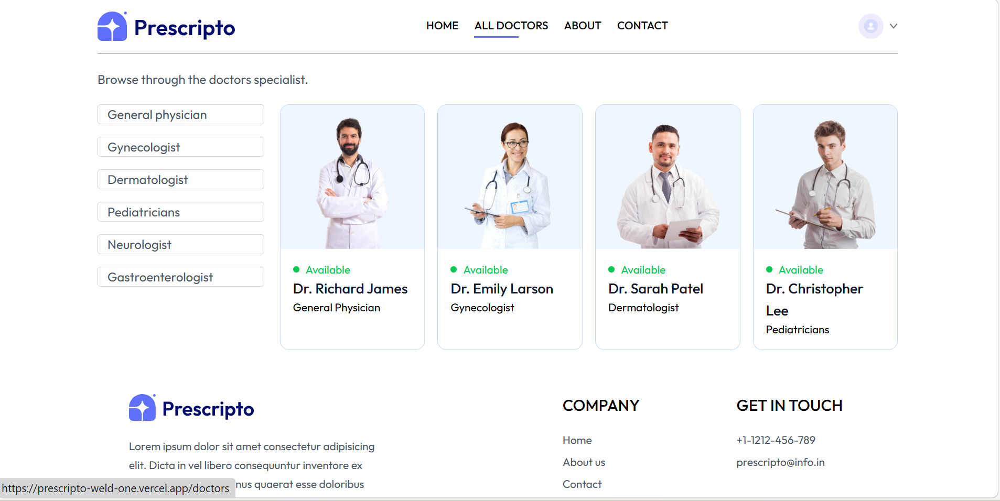
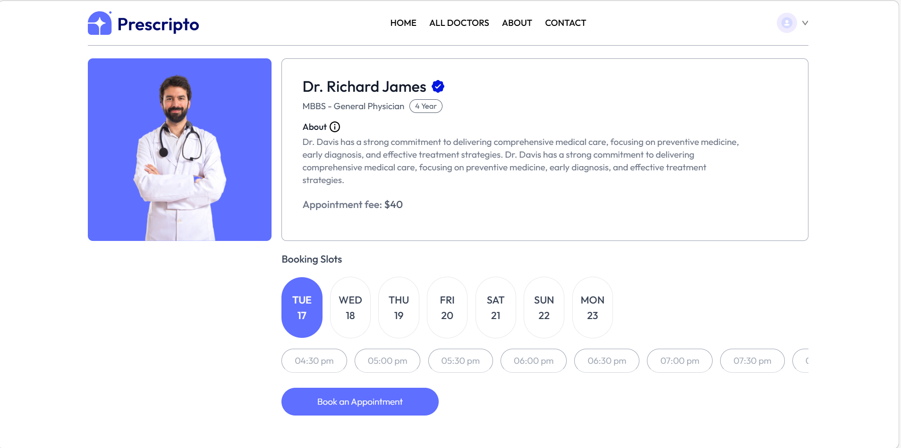
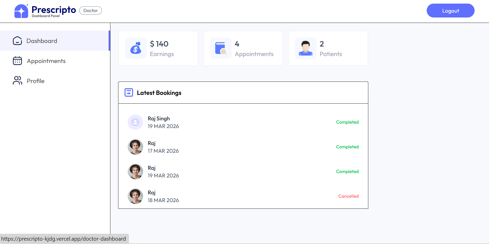
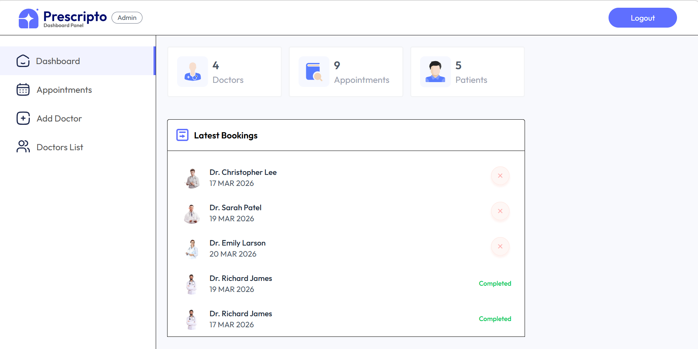

# 🩺 Prescripto – Doctor Appointment Booking Platform


---

## 🚀 Overview

**Prescripto** is a full-stack doctor appointment booking web application that streamlines the interaction between patients, doctors, and administrators.

It provides a seamless experience for booking, managing, and tracking appointments — backed by a scalable backend and intuitive dashboards.

---

## 🌐 Live Demo

- 👤 **User App:** https://prescripto-weld-one.vercel.app  
- 🛠️ **Admin/Doctor Panel:** https://prescripto-kjdg.vercel.app  
- ⚙️ **Backend API:** https://prescripto-backend-4tl8.onrender.com  

---

## ✨ Features

### 👤 User
- 🔐 Secure Login & Registration
- 🩺 Browse doctors by specialization
- 📅 Book appointments easily
- ❌ Cancel appointments
- 📖 View appointment history

### 👨‍⚕️ Doctor
- 🔐 Doctor authentication
- 📋 View assigned appointments
- ✅ Mark appointments as completed
- ❌ Cancel appointments
- 💰 Track earnings dashboard

### 🛡️ Admin
- 📊 Dashboard analytics
- ➕ Add and manage doctors
- 📋 View all appointments
- ⚙️ Full platform control

---

## 🏗️ Tech Stack

### 💻 Frontend
- React.js  
- Tailwind CSS  
- Axios  
- React Router  

### 🔧 Backend
- Node.js  
- Express.js  
- MongoDB (Mongoose)  
- JWT Authentication  

### ☁️ Deployment
- Frontend: Vercel  
- Backend: Render  

---

## 🧩 Architecture

```
Client (React)
      ↓
REST API (Node + Express)
      ↓
MongoDB Database
```

---

## 📁 Project Structure

```
prescripto/
│
├── frontend/          # User application
├── admin/             # Admin & Doctor dashboard
├── backend/           # API and server logic
│
├── models/            # Database schemas
├── routes/            # API routes
├── controllers/       # Core logic
├── middleware/        # Authentication & security
│
└── README.md
```

---

## 🔐 Authentication & Security

- JWT-based authentication  
- Role-based access control (User / Doctor / Admin)  
- Protected API routes  

---

## 🔄 Key Workflows

### 📅 Appointment Booking
1. User logs in  
2. Selects specialization  
3. Chooses doctor  
4. Books appointment  
5. Data stored in database  

### 🛠️ Appointment Management
- Users can cancel bookings  
- Doctors can:
  - Accept / cancel  
  - Mark as completed  

---

## ⚡ API Highlights

- `POST /api/user/login` → User login  
- `GET /api/doctor/list` → Fetch doctors  
- `POST /api/appointment/book` → Book appointment  
- `GET /api/admin/appointments` → Admin access  
- `POST /api/doctor/update-status` → Update status  

---

## 📸 Screenshots

### 🏠 Home Page


### 👨‍⚕️ All Doctors


### 📅 Book Appointment


### 👨‍⚕️ Doctor Dashboard


### 🛡️ Admin Dashboard


---

## 🛠️ Installation & Setup

### 1️⃣ Clone Repository
```bash
git clone https://github.com/raj-balram/prescripto.git
cd prescripto
```

### 2️⃣ Backend Setup
```bash
cd backend
npm install
npm start
```

### 3️⃣ Frontend Setup
```bash
cd frontend
npm install
npm run dev
```

### 4️⃣ Admin Panel Setup
```bash
cd admin
npm install
npm run dev
```

---

## 🚀 Future Enhancements

- 💳 Online payment integration  
- 📧 Email/SMS notifications  
- 📅 Real-time slot booking  
- ⭐ Doctor ratings & reviews  
- 📱 Mobile app (React Native)  

---

## 🌟 Why This Project Stands Out

- ✅ Real-world healthcare use case  
- ✅ Full-stack production-ready app  
- ✅ Multi-role system (User, Doctor, Admin)  
- ✅ Clean UI + scalable backend  
- ✅ Live deployed project  

---

---

## 🤝 Contributing

Contributions are **highly welcome** and appreciated! 🎉  
If you'd like to improve this project, fix bugs, or add new features, feel free to contribute.

### 🚀 How to Contribute

1️⃣ **Fork the Repository**  
Click the "Fork" button at the top right of this repo.

2️⃣ **Clone Your Fork**
```bash
git clone https://github.com/your-username/prescripto.git
cd prescripto
```

3️⃣ **Create a New Branch**
```bash
git checkout -b feature/your-feature-name
```

4️⃣ **Make Your Changes**
- Add features / fix bugs
- Follow clean coding practices

5️⃣ **Commit Your Changes**
```bash
git commit -m "Added: your feature description"
```

6️⃣ **Push to GitHub**
```bash
git push origin feature/your-feature-name
```

7️⃣ **Create a Pull Request (PR)**
- Go to your fork on GitHub
- Click **"Compare & Pull Request"**
- Add a clear description of your changes

---

### 📌 Contribution Guidelines

- ✅ Write clean, readable code  
- ✅ Follow existing project structure  
- ✅ Use meaningful commit messages  
- ✅ Test your changes before submitting  
- ✅ Keep PRs focused and minimal  

---

### 🐛 Reporting Issues

If you find a bug or want to suggest a feature:

- Open an issue in the repository  
- Clearly describe the problem or suggestion  
- Add screenshots (if applicable)  

---

### 💡 Ideas for Contribution

- Improve UI/UX  
- Add payment integration  
- Implement notifications (Email/SMS)  
- Optimize performance  
- Add new features  

---

✨ Every contribution, no matter how small, makes a difference!


## 👨‍💻 Author

**Balram Raj**  

- GitHub: https://github.com/raj-balram  

---

## 📄 License

This project is licensed under the **MIT License**.

---

## 💬 Final Thoughts

Prescripto is a complete end-to-end application showcasing real-world development skills including authentication, role-based systems, API design, and deployment.
